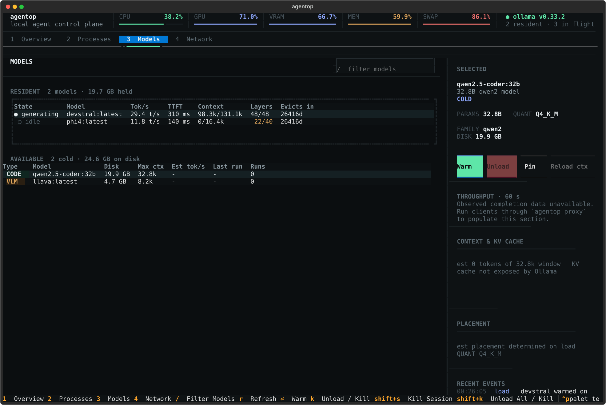

# agentop

See what Ollama is running, understand local LLM performance, and safely
load or unload models—all from one terminal dashboard.



## Install

### macOS Apple Silicon

```bash
curl -fsSL https://raw.githubusercontent.com/blackboxdelta/agentop/main/install.sh | sh
```

### Windows x64 (PowerShell)

```powershell
irm https://raw.githubusercontent.com/blackboxdelta/agentop/main/install.ps1 | iex
```

Then open a new terminal and run:

```bash
agentop
```

Prefer Python packaging? Use:

```bash
uv tool install git+https://github.com/blackboxdelta/agentop.git
```

## What you get

- Live CPU, GPU, unified/VRAM, RAM, swap, and page-in pressure.
- Resident models with throughput, TTFT, context, placement, and eviction time.
- Installed models with size, context window, quantization, and run history.
- A mouse-driven Playground for direct chats and two- or three-model roundtables.
- Safe warm-up preflight before a model can force evictions or swap paging.
- Unload with 5-second undo, pinning, context reload, and unload-all confirmation.
- Local agent-process and port monitoring.
- `agentop --json` for scripts and automation.
- No telemetry. Runtime network calls go only to your configured Ollama host.

## Keys

| Key | Action |
|---|---|
| `1`–`5` | Overview, Processes, Models, Playground, Network |
| `enter` | Warm model / open compact details |
| `k` | Unload model / kill selected process |
| `shift+k` | Unload all / kill selected category |
| `p` | Pin or unpin model |
| `t` | Reload with a smaller default context |
| `u` | Undo last unload |
| `/` | Filter models |
| `r` | Refresh |
| `?` | Help |
| `q` | Quit |

Mouse input works for tabs, rows, filters, buttons, confirmations, and
scrollable panes. The layout adapts from 80×24 through large terminals.

## Run local models

Open the **Playground** tab, choose **Solo**, **2 models**, or **3 models**,
select installed Ollama models, enter a prompt, and click **Run**. Multi-model
mode runs the chosen number of rounds in order, with each model receiving the
discussion so far. **Stop** cancels the active run and keeps partial output;
**Clear** starts a fresh conversation. Each roundtable participant has a
distinct labeled response panel (`[A]`, `[B]`, or `[C]`) and color, with a
visible divider between rounds. Multi-model conversations default to 25 rounds,
and the rounds field validates the supported 1–100 range before a run starts.
Press **Enter** from the prompt field as a shortcut for **Run**.

## Optional request metrics

Ollama does not retain completion history. Run clients through the local
agentop proxy to populate throughput, TTFT, reliability, and session panels:

```bash
agentop proxy --host http://localhost:11434 --port 11435
```

Point your client at `http://127.0.0.1:11435`. Without the proxy, agentop
labels completion-derived fields unavailable instead of inventing values.

## Why it matters

`agentop` shortens diagnosis time, prevents accidental OOM/swap incidents,
and makes developer-machine inference performance predictable without sending
operational data to a third party.

## More

- [Configuration and architecture](docs/ARCHITECTURE.md)
- [Manual installation and release verification](docs/DISTRIBUTION.md)
- [Compact layout screenshot](docs/images/models-compact.svg)
- [Process overview screenshot](docs/images/overview.svg)

## Develop

```bash
git clone https://github.com/blackboxdelta/agentop.git
cd agentop
uv sync --group dev
uv run pytest -q
```

The release suite currently includes 100 unit, integration, safety, proxy,
cross-platform, and layout tests.
