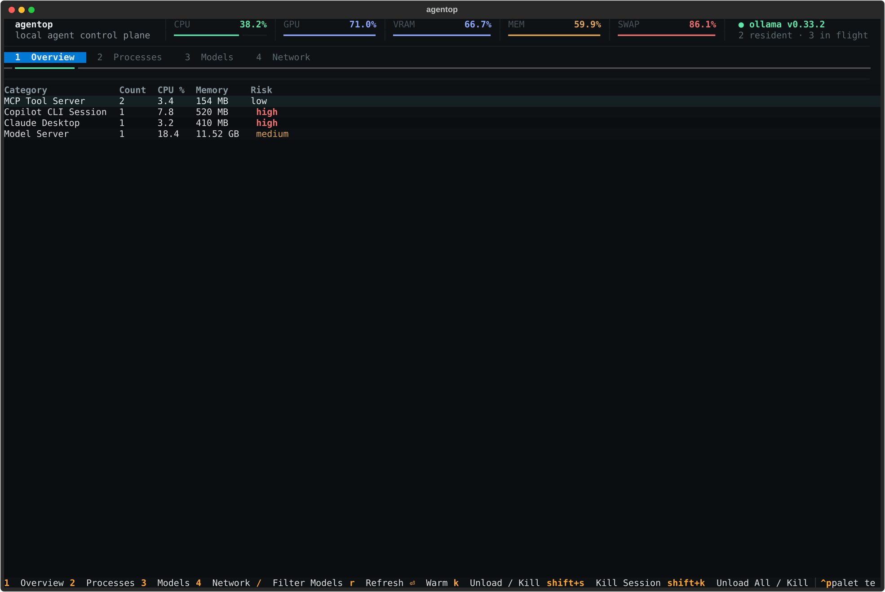
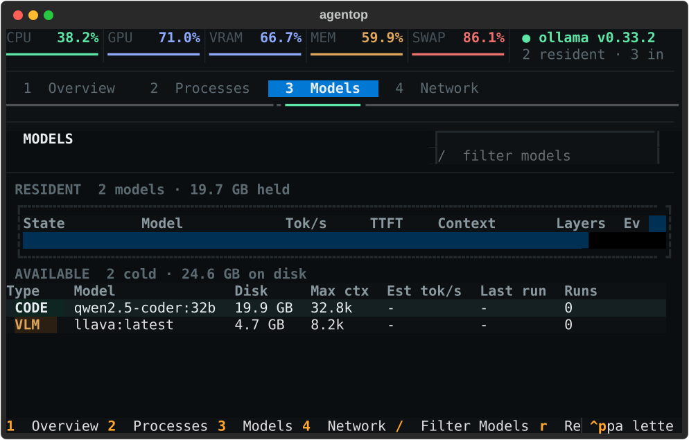

# agentop

Production-grade terminal monitoring and control for locally or remotely
hosted Ollama models. `agentop` combines live host/GPU metrics, resident and
installed model state, safe model lifecycle controls, persistent completion
history, and the existing local AI-agent process controls in one TUI.

No telemetry is collected. At runtime, network requests go only to the
configured Ollama host.

## Why agentop

Local LLM deployments often fail operationally rather than functionally:
models compete for memory, swap quietly destroys latency, idle runners retain
scarce capacity, and teams have no request history because Ollama intentionally
does not provide one. `agentop` gives developers and platform teams one place
to answer:

- Which models are resident, where are their layers placed, and when will they
  be evicted?
- Will a cold model fit before it is loaded, and what would need to leave?
- What throughput, TTFT, reliability, and client usage has actually been
  observed?
- Is poor performance caused by CPU, GPU, unified/VRAM pressure, RAM, or swap?
- Which local AI-agent processes and ports are consuming host resources?

The business value is shorter diagnosis time, fewer accidental OOM/swap
incidents, predictable developer-machine performance, and a scriptable source
of local inference health without sending operational data to a third party.

## Screenshots

### Model operations and reliability


### Host and process overview



### Compact 80×24 layout



## Platforms

- macOS Apple Silicon (arm64): Apple GPU utilization and unified-memory use
  through IORegistry/AGX counters.
- Windows x64: NVIDIA GPU metrics through NVML when an NVIDIA driver is
  present; AMD metrics through `rocm-smi` when installed.
- Linux remains source-installable and uses the same NVIDIA/AMD collectors.

Tagged releases produce standalone downloads:

- `agentop-macos-arm64.tar.gz`
- `agentop-windows-x64.zip`

Each artifact includes a SHA-256 checksum. macOS Intel builds are intentionally
not produced.

See [distribution and installation](docs/DISTRIBUTION.md) for platform-specific
steps and [architecture and data integrity](docs/ARCHITECTURE.md) for runtime,
privacy, proxy, and safety design.

## Install

### Standalone download

Download the archive for your platform from the GitHub release, verify the
adjacent `.sha256`, extract it, and place `agentop` (`agentop.exe` on Windows)
on your `PATH`.

### From source

```bash
uv tool install .
agentop --version
```

Development installs can stay editable:

```bash
uv tool install --editable .
```

## Use

```bash
agentop
agentop --host http://remote-ollama:11434
agentop --json
```

Configuration precedence is CLI flags, then `OLLAMA_HOST`, then the config
file, then defaults. Copy [`config.example.toml`](config.example.toml) to:

- macOS/Linux: `~/.config/agentop/config.toml`
- Windows: `%APPDATA%\agentop\config.toml`

Completion/event history defaults to:

- macOS/Linux: `~/.local/state/agentop/events.db`
- Windows: `%LOCALAPPDATA%\agentop\events.db`

The SQLite store uses WAL mode and retains only local operational metadata.

## Completion proxy

Ollama does not expose request history. To populate throughput, TTFT,
reliability, token, and client-session panels, point clients through the
optional local proxy:

```bash
agentop proxy --host http://localhost:11434 --listen 127.0.0.1 --port 11435
```

Then configure clients to use `http://127.0.0.1:11435`. The proxy forwards only
to the configured Ollama host and records rolling metrics in the same local
SQLite store. Without the proxy, agentop clearly labels completion-derived
panels unavailable instead of inventing values.

## Interface

The three-row header keeps CPU, GPU, VRAM/unified memory, RAM, swap/page-in,
Ollama version, resident count, in-flight requests, and queue depth visible.
Number keys switch workspaces:

1. **Overview** — local AI-agent processes grouped by runtime.
2. **Processes** — sortable process list and confirmation-gated kill controls.
3. **Models** — resident and cold model tables plus a selected-model inspector.
4. **Network** — listening ports owned by detected AI-agent processes.

The Models inspector includes observed throughput, context use, placement,
24-hour reliability, recent client sessions, and persisted events. Cold-model
actions use an explicit memory pre-flight if the model does not fit current
free memory.

### Keys

| Key | Models | Other workspaces |
|---|---|---|
| `1`–`4` | Switch workspace | Switch workspace |
| `enter` | Warm model / open compact details | — |
| `k` | Unload with 5-second undo | Kill selected process |
| `shift+k` | Unload all (type `yes`) | Kill selected category |
| `t` | Reload runner with a smaller default context | — |
| `p` | Pin/unpin model | — |
| `u` | Undo last unload | — |
| `/` | Focus model filter | — |
| `r` | Refresh | Refresh |
| `?` | Help | Help |
| `q` | Quit | Quit |

Mouse input is supported for tabs, tables, filters, action buttons,
confirmations, and scrollable panes. Below 120 columns, the model inspector
becomes a full-body toggle: `enter` opens it and `esc` returns to the list.

Context reload changes the runner's default `num_ctx`; it does not modify
already-issued conversation requests.

### Safe model loading

If a cold model does not fit within available memory plus the configured
safety headroom, `agentop` presents a pre-flight plan before doing anything.
The plan labels its memory requirement as an estimate, names proposed
evictions, predicts paging, and shows estimated load time. After confirmation,
agentop re-polls Ollama and recomputes the plan. If the target load fails,
successfully evicted models are restored where possible.

`NO_COLOR=1 agentop` enables the no-color fallback. Textual automatically
maps the 24-bit palette on terminals without truecolor support.

## JSON snapshot

`agentop --json` emits one machine-readable snapshot and exits. It includes
host/GPU metrics, Ollama state, model metadata, completion summaries, recent
events, and detected local agent processes.

## Development

```bash
uv sync --group dev
uv run pytest -q
```

The test suite includes metric/parser tests, fit-planner tests, SQLite tests,
async mock-Ollama tests, proxy integration, process-signal safety tests, and
layout snapshots for every pane at 80×24, 120×30, and 200×60.

Build the platform-native standalone executable:

```bash
uv run pyinstaller --clean --onefile --name agentop \
  --collect-data agentop \
  --collect-submodules textual \
  --collect-submodules pynvml \
  src/agentop/__main__.py
```
