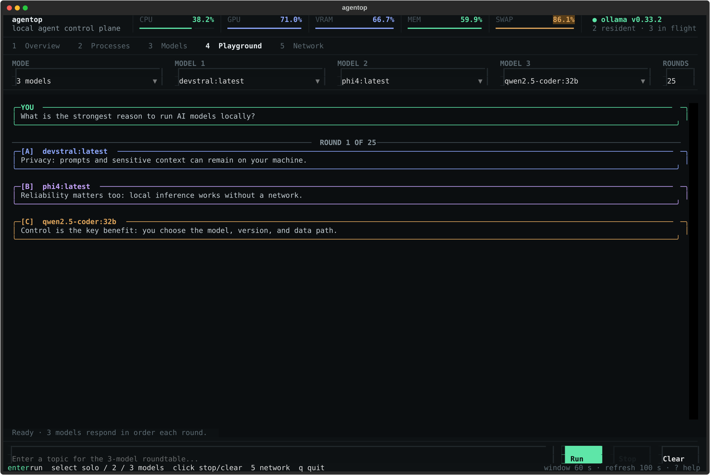
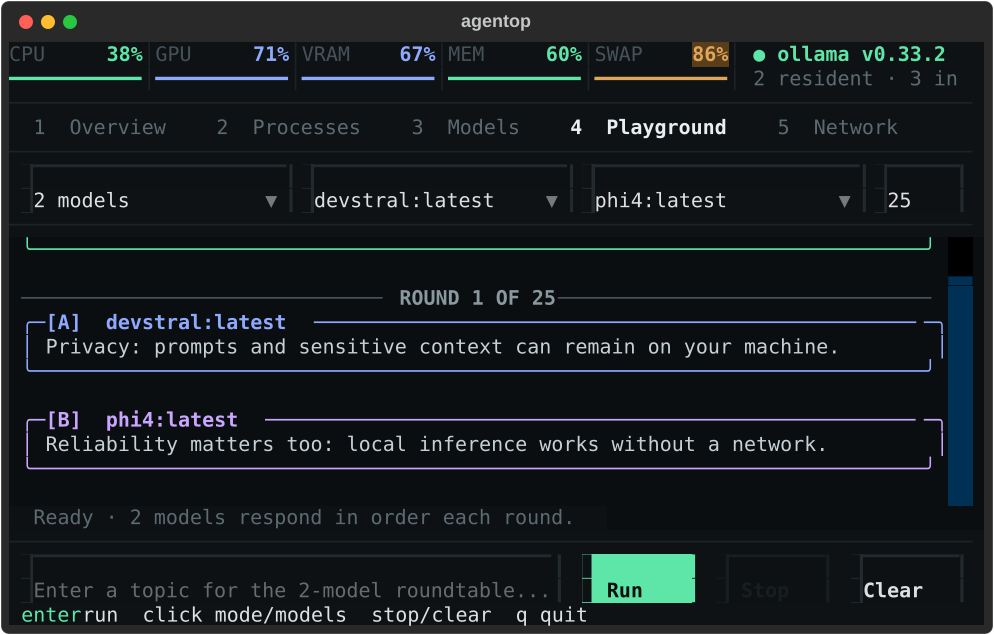

# Ollama Playground

The Playground runs installed Ollama models from the AgentOp terminal UI. It
supports direct chat with one model and ordered roundtables with two or three
models.



## Start a conversation

1. Start Ollama, then run `agentop`.
2. Open **4 Playground**.
3. Choose **Solo**, **2 models**, or **3 models**.
4. Select a different installed model for each roundtable seat.
5. For a roundtable, choose from 1 to 100 rounds. The default is 25.
6. Enter a prompt or topic, then click **Run** or press **Enter**.

Responses appear after each model finishes. **Stop** cancels the active run and
keeps completed responses. **Clear** removes the current conversation.

## Read the transcript

- **YOU** uses a green panel.
- **[A]** uses blue, **[B]** uses purple, and **[C]** uses amber.
- A labeled divider separates every round.
- The status line shows the active round and model.



## How roundtables work

Models run sequentially in A, B, C order. Before each response, AgentOp sends
that model the topic and the discussion so far. Later participants can react to
earlier responses, and the next round continues from the accumulated
conversation.

The discussion included in a request is bounded to the most recent 24,000
characters. Changing the mode or selected models starts a new conversation.
Changing only the round count continues the existing conversation.

The total number of model calls is:

```text
selected models × rounds
```

A three-model, 25-round conversation makes 75 sequential model calls. Longer
runs can take substantial time and memory; use **Stop** whenever needed.

## GPU and memory

The terminal UI itself does not require GPU acceleration. Ollama chooses CPU,
GPU, or mixed placement for each selected model. Open **3 Models** to inspect
resident models, placement, unified/VRAM use, and memory pressure.

Selecting multiple models does not guarantee that all of them remain resident
simultaneously. Ollama may load and evict models according to available memory.
Smaller models are better for long roundtables on memory-constrained systems.

## Privacy and storage

Playground requests go only to the configured Ollama host, which is
`http://localhost:11434` by default. If you configure a remote host, prompts and
responses are sent to that host.

AgentOp keeps the active Playground transcript in memory. It does not write
prompt or response bodies to the event database. Closing AgentOp clears the
conversation.
